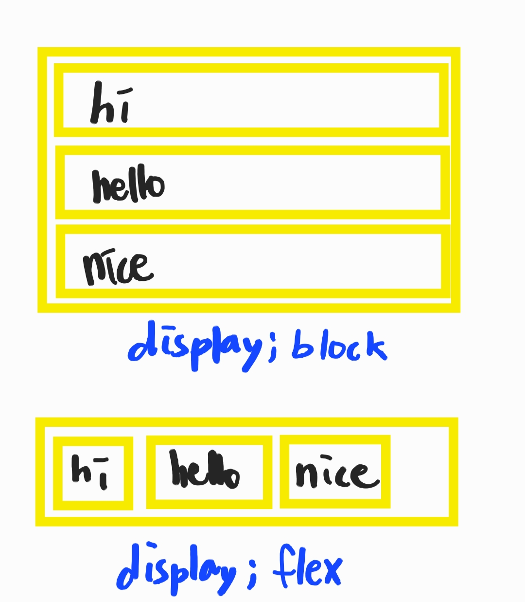

# Flex & Grid

## Flex

- 기본 구조

```html
    <div class="container">
	<div class="item">hi</div>
	<div class="item">hello</div>
	<div class="item">nice</div>
</div>
```

🧡❤❤💚💙💙 메인축 수직축 사진 넣기

<br><br>

---

* `display:flex` : flex 컨테이너에 적용

    ```css
        .container {
	        display: flex;
        }
    ```
    <details>
    <summary>🧡 display:block</summary>
    
    </details>

    <details>
    <summary>💛 display:flex</summary>
    
    </details>
    
    - `width`는 내용물의 width만큼만 차지

    - `height`는 컨테이너의 높이만큼 늘어남

<br><br>

---

* `flex-direction` : 배치방향

    ```css
    .container {
	    flex-direction: row; /* 아이템들이 행(가로) 방향 */
	    flex-direction: column; /* 아이템들이 역순 행(가로) 방향 */
	    flex-direction: row-reverse; /* 아이템들이 열(세로) 방향 */
	    flex-direction: column-reverse; /* 아이템들이 역순으로 열(세로) 방향 */
    }
    ```

    <details>
    <summary>💛 flex-direction: row</summary>
    
    </details>

    <details>
    <summary>💛 flex-direction: column</summary>
    
    </details>

    <details>
    <summary>💛 flex-direction: row-reverse</summary>
    
    </details>
    
    <details>
    <summary>💛 flex-direction: column-reverse</summary>
    
    </details>


<br><br>

---

* `flex-wrap` : 줄넘김 처리 => 컨테이너가 아이템들을 한 줄에 담을 공간이 없을 때

    ```css
    .container {
	    flex-wrap: nowrap; /* 줄바꿈을 하지 않고 넘치면 빠져나감 */
	    flex-wrap: wrap; /* 줄바꿈을 함 */
	    flex-wrap: wrap-reverse; /* 줄바꿈도 하고 아이템도 역순으로 배치 */
    }
    ```

<br><br>

---

* `flex-flow` : flex-direction과 flex-wrap을 한꺼번에 지정

    ```css
    .container {
	flex-flow: row wrap;
	/* 아래의 두 줄을 줄여 쓴 것 */
	/* flex-direction: row; */
	/* flex-wrap: wrap; */
    }
    ```

<br><br>


<br><br>

---

* `justify-content` : 메인축 방향으로 아이템들을 정렬

    ```css
    .container {
	justify-content: flex-start; /* 아이템을 시작점으로 정렬 */
    /* flex-direction이 row일 땐 왼쪽 column일 땐 위 */

	justify-content: flex-end; /* 아이템들을 끝점으로 정렬 */
    /* flex-direction이 row일 땐 오른쪽 column일 땐 아래 */

	justify-content: center; /* 아이템들을 가운데로 정렬 */

	justify-content: space-between; /* 아이템들의 “사이(between)”에 균일한 간격 */

	justify-content: space-around; /* 아이템들의 “둘레(around)”에 균일한 간격 */

	justify-content: space-evenly; /* 아이템들의 사이와 양 끝에 균일한 간격 */
    }
    ```

    <details>
    <summary>💛 justify-content: flex-start</summary>
    
    </details>

    <details>
    <summary>💛 justify-content: flex-end</summary>
    
    </details>

    <details>
    <summary>💛 justify-content: center</summary>
    
    </details>
    
    <details>
    <summary>💛 justify-content: space-between</summary>
    
    </details>

    <details>
    <summary>💛 justify-content: space-around</summary>
    
    </details>

    <details>
    <summary>💛 justify-content: space-evenly</summary>
    
    </details>

<br><br>

---

* `align-items` : 수직축 방향으로 아이템들을 정렬

    ```css
    .container {
	align-items: stretch; /* 아이템들이 수직축 방향으로 끝까지 쭈욱 늘어남 */

	align-items: flex-start; /* 아이템들을 시작점으로 정렬 */
    /* flex-direction이 row일 때는 위, column일 때는 왼쪽 */

	align-items: flex-end; /* 아이템들을 끝으로 정렬 */
    /* flex-direction이 row일 때는 아래, column일 때는 오른쪽 */

	align-items: center; /* 아이템들을 가운데로 정렬 */

	align-items: baseline; /* 아이템들을 텍스트 베이스라인 기준으로 정렬 */
    }
    ```

    <details>
    <summary>💛 justify-content: flex-start</summary>
    
    </details>

    <details>
    <summary>💛 justify-content: flex-end</summary>
    
    </details>

    <details>
    <summary>💛 justify-content: center</summary>
    
    </details>
    
    <details>
    <summary>💛 justify-content: space-between</summary>
    
    </details>

    <details>
    <summary>💛 justify-content: space-around</summary>
    
    </details>

    <details>
    <summary>💛 justify-content: space-evenly</summary>
    
    </details>


# 선택자

1. 태그 선택자
2. 클래스 선택자
4. 자식 선택자
5. 자손 선택자
7. 형제 선택자
8. 그룹 선택자
9. 가상 클래스 선택자
10. 수열 선택자
11. 상태 선택자
12. 속성 선택자
13. 그외 선택자
